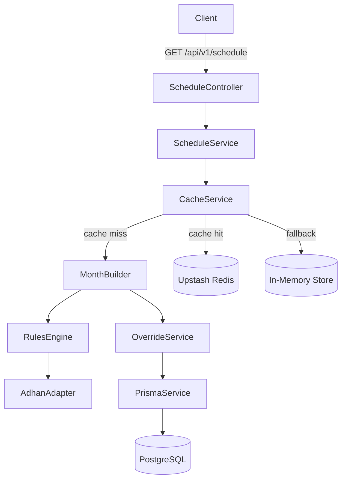

# Design Document — iqama-engine

## Overview

The `iqama-engine` is a NestJS REST API that acts as a deterministic rules engine for computing Islamic congregation (Iqama) times. It wraps the `adhan` npm library for raw astronomical prayer-time calculation and applies a layered set of community rules (FR1–FR6) to produce the final schedule.

The system is designed around three concerns that are kept strictly separate:

1. **Astronomical calculation** — delegated entirely to the `adhan` library.
2. **Rules application** — a pure, stateless transformation from raw Azan times to Iqama times.
3. **Serving & caching** — an HTTP layer that caches full monthly schedules in Redis and resolves admin overrides from PostgreSQL before invoking the rules engine.

### Key Design Decisions

- **Month-granularity caching**: The cache stores an entire calendar month as a single Redis entry. This avoids per-day cache misses and makes cache invalidation simple (one key per month). The tradeoff is a slightly larger first-request cost, which is acceptable because the computation is fast and deterministic.
- **Friday Block as a pure function**: The Friday Block Shift (FR5) is implemented as a date-routing concern inside the Rules Engine — it redirects the input date to the preceding Friday before calling FR3/FR4. This keeps the individual rule functions (FR3, FR4) unaware of the block mechanism.
- **Override interception before rules**: Admin overrides are resolved by the Override Service before the Rules Engine is invoked. A prayer with an active override never reaches FR1–FR5, which keeps the rules engine pure and testable in isolation.
- **Graceful Redis fallback**: The `@nestjs/cache-manager` module is configured with Upstash Redis as the primary store. If the Redis connection is unavailable at startup or runtime, the module falls back to an in-memory store transparently, so the service remains operational.
- **`adhan` rounding disabled**: The `adhan` library's built-in rounding is set to `Rounding.None` so that raw sub-minute precision is preserved. All rounding is performed explicitly by the Rules Engine (CeilingToNearest5, CeilingToNearest30).

---

## Architecture



### Module Structure

```
src/
  app.module.ts
  config/
    app.config.ts          # env-backed ConfigService values
  schedule/
    schedule.module.ts
    schedule.controller.ts
    schedule.service.ts
    dto/
      schedule-query.dto.ts
      daily-schedule.dto.ts
  cache/
    cache.module.ts
    cache.service.ts
  rules/
    rules.module.ts
    rules.service.ts       # FR1–FR5 orchestration
    fr1-maghrib.rule.ts
    fr2-dhuhr.rule.ts
    fr3-fajr.rule.ts
    fr4-asr-isha.rule.ts
    fr5-friday-block.rule.ts
    time-utils.ts          # CeilingToNearest5, CeilingToNearest30, formatHHmm
  adhan/
    adhan.module.ts
    adhan.adapter.ts       # wraps adhan PrayerTimes
  override/
    override.module.ts
    override.service.ts
  prisma/
    prisma.module.ts
    prisma.service.ts
```

---

## Components and Interfaces

### AdhanAdapter

Wraps the `adhan` library. Initialized once with the configured coordinates and calculation parameters.

```typescript
interface RawPrayerTimes {
  fajr: Date;
  sunrise: Date;
  dhuhr: Date;
  asr: Date;
  maghrib: Date;
  isha: Date;
}

class AdhanAdapter {
  getPrayerTimes(date: Date): RawPrayerTimes;
}
```

**Adhan configuration:**
```typescript
import { Coordinates, CalculationMethod, PrayerTimes, Madhab, Rounding } from 'adhan';

const coordinates = new Coordinates(lat, lng);
const params = CalculationMethod.NorthAmerica(); // ISNA method
params.madhab = Madhab.Shafi;                    // Asr standard (shadow ratio = 1)
params.rounding = Rounding.None;                 // preserve sub-minute precision

const pt = new PrayerTimes(coordinates, jsDate, params);
// pt.fajr, pt.sunrise, pt.dhuhr, pt.asr, pt.maghrib, pt.isha are UTC Date objects
// Convert to Masjid_Timezone using dayjs-timezone before rules application
```

### RulesService

Orchestrates FR1–FR5 for a single date. Accepts raw prayer times and returns computed Iqama times.

```typescript
interface IqamaTimes {
  fajr: string;    // HH:mm
  dhuhr: string;
  asr: string;
  maghrib: string;
  isha: string;
}

class RulesService {
  computeIqama(date: string, raw: RawPrayerTimes, fridayRaw?: RawPrayerTimes): IqamaTimes;
}
```

`fridayRaw` is populated by the Friday Block logic (FR5) when the requested date is not a Friday. When it is provided, FR3 and FR4 use `fridayRaw` instead of `raw` for Fajr, Asr, and Isha.

### OverrideService

```typescript
interface Override {
  prayer: 'fajr' | 'dhuhr' | 'asr' | 'maghrib' | 'isha';
  overrideType: 'FIXED' | 'OFFSET';
  value: string; // HH:mm for FIXED, numeric string (minutes) for OFFSET
}

class OverrideService {
  getOverridesForDate(date: string): Promise<Override[]>;
}
```

### CacheService

```typescript
class CacheService {
  getOrBuildMonth(yearMonth: string): Promise<DailySchedule[]>;
  // yearMonth format: "YYYY-MM"
  // Cache key: "schedule:YYYY-MM"
  // TTL: 30 days (2_592_000_000 ms)
}
```

### ScheduleService

```typescript
class ScheduleService {
  getScheduleForDate(date: string): Promise<DailySchedule>;
  getScheduleForRange(startDate: string, endDate: string): Promise<DailySchedule[]>;
}
```

### ScheduleController

```typescript
@Controller('api/v1/schedule')
class ScheduleController {
  @Get()
  getSchedule(@Query() query: ScheduleQueryDto): Promise<DailySchedule | DailySchedule[]>;
}
```

---

## Data Models

### ScheduleQueryDto

```typescript
class ScheduleQueryDto {
  @IsOptional()
  @Matches(/^\d{4}-\d{2}-\d{2}$/)
  date?: string;

  @IsOptional()
  @Matches(/^\d{4}-\d{2}-\d{2}$/)
  start_date?: string;

  @IsOptional()
  @Matches(/^\d{4}-\d{2}-\d{2}$/)
  end_date?: string;
}
```

Validation logic (enforced in the service or a custom pipe):
- `date` and (`start_date` or `end_date`) are mutually exclusive → 400
- Neither `date` nor both of `start_date`+`end_date` provided → 400

### DailySchedule (response shape)

```typescript
interface PrayerEntry {
  azan: string;   // HH:mm
  iqama: string;  // HH:mm
}

interface DailySchedule {
  date: string;         // YYYY-MM-DD
  day_of_week: string;  // e.g. "Friday"
  is_dst: boolean;
  fajr: PrayerEntry;
  dhuhr: PrayerEntry;
  asr: PrayerEntry;
  maghrib: PrayerEntry;
  isha: PrayerEntry;
  metadata: {
    calculation_method: 'ISNA';
    has_overrides: boolean;
  };
}
```

### Overrides Table (Prisma schema)

```prisma
model Override {
  id           Int      @id @default(autoincrement())
  prayer       String   // "fajr" | "dhuhr" | "asr" | "maghrib" | "isha"
  overrideType String   // "FIXED" | "OFFSET"
  value        String   // HH:mm for FIXED, integer minutes as string for OFFSET
  startDate    DateTime @db.Date
  endDate      DateTime @db.Date
  createdAt    DateTime @default(now())
  updatedAt    DateTime @updatedAt
}
```

### Environment Variables

| Variable | Default | Description |
|---|---|---|
| `MASJID_LATITUDE` | `49.2514` | Masjid latitude |
| `MASJID_LONGITUDE` | `-122.7740` | Masjid longitude |
| `MASJID_TIMEZONE` | `America/Vancouver` | IANA timezone string |
| `UPSTASH_REDIS_URL` | — | Upstash Redis REST URL |
| `UPSTASH_REDIS_TOKEN` | — | Upstash Redis REST token |
| `DATABASE_URL` | — | PostgreSQL connection string |

---

## Rules Engine — Detailed Logic

### Time Utilities

```typescript
// Round minutes up to the nearest 5-minute boundary
function ceilingToNearest5(dayjsObj: Dayjs): Dayjs {
  const m = dayjsObj.minute();
  const s = dayjsObj.second();
  const totalMinutes = m + (s > 0 ? 1 : 0); // sub-minute → next minute
  const rounded = Math.ceil(totalMinutes / 5) * 5;
  return dayjsObj.startOf('minute').minute(rounded).second(0);
}

// Round minutes up to the nearest 30-minute boundary (:00 or :30)
function ceilingToNearest30(dayjsObj: Dayjs): Dayjs {
  const m = dayjsObj.minute();
  const s = dayjsObj.second();
  const totalMinutes = m + (s > 0 ? 1 : 0);
  const rounded = Math.ceil(totalMinutes / 30) * 30;
  return dayjsObj.startOf('minute').minute(rounded).second(0);
}

// Format a dayjs object to HH:mm in Masjid_Timezone
function formatHHmm(dayjsObj: Dayjs, tz: string): string {
  return dayjsObj.tz(tz).format('HH:mm');
}
```

### FR1 — Maghrib

```
Iqama = CeilingToNearest5(Azan + 5 min)
```

No Friday Block. Uses the date's own Azan.

### FR2 — Dhuhr

```
if DST active:  Iqama = "13:45"
else:           Iqama = "12:45"
```

DST detection: `dayjs.tz(date, timezone).utcOffset() !== dayjs.tz(date, timezone).startOf('year').utcOffset()`

A simpler and more reliable approach: compare the UTC offset of the requested date against the UTC offset of January 1st of the same year. If the offset is greater (less negative), DST is active.

No Friday Block. Ignores raw Azan.

### FR3 — Fajr

```
Max_Delay          = Azan + 75 min
Safe_Sunrise_Limit = Sunrise - 45 min
Base_Target        = min(Max_Delay, Safe_Sunrise_Limit)
if Base_Target < Azan + 10 min:
    Base_Target = Azan + 10 min
Iqama = CeilingToNearest5(Base_Target)
```

When Friday Block is active, `Azan` and `Sunrise` are taken from the preceding Friday's raw times.

### FR4 — Asr

```
Iqama = CeilingToNearest30(Azan + 15 min)
```

When Friday Block is active, `Azan` is taken from the preceding Friday's raw Asr time.

### FR4 — Isha

```
if Azan > 22:30:  gap = 5
if Azan < 20:00:  gap = 15
else:             gap = 15 - 10 * (Azan - 20:00) / (22:30 - 20:00)
                      = 15 - 10 * minutesSince2000 / 150
Iqama = CeilingToNearest5(Azan + gap)
```

When Friday Block is active, `Azan` is taken from the preceding Friday's raw Isha time.

### FR5 — Friday Block

```
if dayOfWeek(date) == Friday:
    fridayDate = date
else:
    fridayDate = most recent preceding Friday
    
fridayRaw = adhan.getPrayerTimes(fridayDate)

Fajr_Iqama  = FR3(fridayRaw.fajr, fridayRaw.sunrise)
Asr_Iqama   = FR4_Asr(fridayRaw.asr)
Isha_Iqama  = FR4_Isha(fridayRaw.isha)
```

Maghrib and Dhuhr always use the requested date's own data.

### FR6 — Override Interception

For each prayer in `['fajr', 'dhuhr', 'asr', 'maghrib', 'isha']`:

```
overrides = OverrideService.getOverridesForDate(date)
for each prayer:
  if override exists with type FIXED:
    iqama[prayer] = override.value   // HH:mm string, no rules applied
  elif override exists with type OFFSET:
    iqama[prayer] = CeilingToNearest5(Azan + offset_minutes)
  else:
    iqama[prayer] = FR1–FR5 result
```

### Monthly Cache Build Flow

```
1. Determine year and month from requested date
2. Check Redis for key "schedule:YYYY-MM"
3. If hit: deserialize, filter to requested date(s), return
4. If miss:
   a. Enumerate all days in the month
   b. For each day:
      i.  Determine fridayDate (same day if Friday, else preceding Friday)
      ii. If fridayDate is in prior month, compute that Friday's raw times
      iii. Fetch overrides for the day
      iv. Apply FR6 → FR1–FR5 as appropriate
      v.  Build DailySchedule object
   c. Serialize full array to JSON
   d. Store in Redis with TTL = 30 days
   e. Filter and return requested date(s)
```

---

## Error Handling

| Scenario | HTTP Status | Response |
|---|---|---|
| `date` + `start_date`/`end_date` both provided | 400 | `{ message: "Cannot use 'date' together with 'start_date' or 'end_date'" }` |
| Neither `date` nor `start_date`+`end_date` | 400 | `{ message: "Provide either 'date' or both 'start_date' and 'end_date'" }` |
| Only one of `start_date`/`end_date` | 400 | `{ message: "'start_date' and 'end_date' must be provided together" }` |
| Invalid date format | 400 | `{ message: "Date values must be in YYYY-MM-DD format" }` |
| `start_date` > `end_date` | 400 | `{ message: "'start_date' must not be after 'end_date'" }` |
| Redis unavailable | — | Transparent fallback to in-memory cache; no error surfaced to client |
| PostgreSQL unavailable | 503 | `{ message: "Service temporarily unavailable" }` |
| Adhan library returns undefined time (polar edge case) | 500 | `{ message: "Could not compute prayer times for the requested date" }` |

All errors follow NestJS's standard exception filter format with `statusCode`, `message`, and `error` fields.

---

## Testing Strategy

### Unit Tests

Each rule function (FR1–FR5) is tested in isolation with concrete examples:
- FR1: verify `CeilingToNearest5(Azan + 5)` for a known Azan time
- FR2: verify `13:45` when DST active, `12:45` when not
- FR3: verify the three branches (Max_Delay wins, Safe_Sunrise_Limit wins, floor clamp applied)
- FR4 Asr: verify rounding to `:00` and `:30` boundaries
- FR4 Isha: verify the three Isha branches (before 20:00, after 22:30, interpolated)
- FR5: verify that Saturday–Thursday use the preceding Friday's data
- FR6: verify FIXED override bypasses rules, OFFSET override applies correctly

### Property-Based Tests

The property-based testing library for this project is **[fast-check](https://github.com/dubzzz/fast-check)** (TypeScript-native, no extra setup).

Each property test runs a minimum of **100 iterations**.

Tag format: `// Feature: iqama-engine, Property N: <property text>`

### Integration Tests

- `GET /api/v1/schedule?date=YYYY-MM-DD` returns a valid `DailySchedule` object
- `GET /api/v1/schedule?start_date=...&end_date=...` returns an array of the correct length
- Invalid query parameter combinations return 400 with descriptive messages
- Override records in the database are reflected in the response with `has_overrides: true`
- Cache hit path: second request for the same month is served from cache (verified by mocking Redis)

### Smoke Tests

- Service starts with valid environment configuration
- Prisma connects to PostgreSQL on startup
- Redis connection is attempted; in-memory fallback activates when unavailable


---

## Correctness Properties

*A property is a characteristic or behavior that should hold true across all valid executions of a system — essentially, a formal statement about what the system should do. Properties serve as the bridge between human-readable specifications and machine-verifiable correctness guarantees.*

The property-based testing library for this project is **[fast-check](https://github.com/dubzzz/fast-check)** (TypeScript-native). Each property test runs a minimum of **100 iterations**.

---

### Property 1: Maghrib Iqama formula holds for all Azan times

*For any* valid Maghrib Azan time (represented as minutes since midnight), the computed Maghrib Iqama must equal `CeilingToNearest5(Azan + 5 minutes)`.

**Validates: Requirements 2.1**

---

### Property 2: DST flag is correct for all dates

*For any* date in the Masjid_Timezone, the `is_dst` field in the response must equal `true` if and only if the UTC offset of that date is greater than the UTC offset of January 1st of the same year (as determined by `dayjs.tz`).

**Validates: Requirements 3.3**

---

### Property 3: Fajr Iqama satisfies the floor clamp and rounding invariants

*For any* Fajr Azan time and Sunrise time, the computed Fajr Iqama must satisfy both:
1. `Iqama >= Azan + 10 minutes` (floor clamp is always respected), and
2. `Iqama minutes value is divisible by 5` (CeilingToNearest5 was applied).

**Validates: Requirements 4.4, 4.5**

---

### Property 4: Asr Iqama always lands on a :00 or :30 boundary

*For any* Asr Azan time, the computed Asr Iqama must satisfy both:
1. `Iqama minutes value is either 0 or 30`, and
2. `Iqama >= Azan + 15 minutes`.

**Validates: Requirements 5.1**

---

### Property 5: Isha gap is always in [5, 15] minutes and output is rounded to nearest 5

*For any* Isha Azan time, the interpolated gap used to compute the Iqama must be in the range `[5, 15]` minutes (inclusive), and the final Iqama must equal `CeilingToNearest5(Azan + gap)`. Specifically:
- If Azan > 22:30, gap = 5
- If Azan < 20:00, gap = 15
- If Azan ∈ [20:00, 22:30], gap ∈ [5, 15] and decreases monotonically as Azan increases

**Validates: Requirements 5.2, 5.3, 5.4**

---

### Property 6: Friday Block — non-Friday dates use the preceding Friday's Fajr, Asr, and Isha Iqama

*For any* non-Friday date D, the computed Fajr, Asr, and Isha Iqama times must equal the Fajr, Asr, and Isha Iqama times that would be computed for the immediately preceding Friday. The preceding Friday must be the most recent Friday strictly before D (1–6 days prior).

**Validates: Requirements 6.2, 6.3, 6.4**

---

### Property 7: Maghrib and Dhuhr are never affected by the Friday Block

*For any* non-Friday date D, the Maghrib Iqama must equal `CeilingToNearest5(D's own Maghrib Azan + 5 minutes)`, and the Dhuhr Iqama must equal the DST-determined fixed value (`13:45` or `12:45`) for date D — neither must equal the preceding Friday's value when the Azans differ.

**Validates: Requirements 2.2, 2.3, 3.5, 6.5**

---

### Property 8: FIXED override always replaces the Iqama; OFFSET override applies CeilingToNearest5; has_overrides reflects override application

*For any* prayer and any Azan time:
- If a FIXED override is active, the Iqama must equal the override's `value` field exactly, regardless of the Azan time.
- If an OFFSET override is active, the Iqama must equal `CeilingToNearest5(Azan + offset_minutes)`.
- The `has_overrides` field in `metadata` must be `true` if and only if at least one override was applied for that date.

**Validates: Requirements 7.2, 7.3, 7.6**

---

### Property 9: Single-date response contains all required fields and all time values are valid HH:mm strings

*For any* valid `YYYY-MM-DD` date, the response object must contain: `date` (matching the input), `day_of_week` (a full English weekday name), `is_dst` (boolean), `fajr`, `dhuhr`, `asr`, `maghrib`, `isha` (each with `azan` and `iqama` fields), and `metadata` with `calculation_method` and `has_overrides`. Every `azan` and `iqama` value must match the pattern `/^\d{2}:\d{2}$/`.

**Validates: Requirements 8.2, 9.1, 9.2, 9.3**

---

### Property 10: Date-range response contains exactly the right number of entries

*For any* valid `start_date` and `end_date` where `start_date <= end_date`, the response array must contain exactly `daysBetween(start_date, end_date) + 1` entries, and the `date` fields must form a contiguous, ascending sequence from `start_date` to `end_date`.

**Validates: Requirements 8.3**

---

### Property 11: Monthly cache contains exactly one entry per day in the month

*For any* year-month, when the cache is built, the stored array must contain exactly as many `DailySchedule` entries as there are calendar days in that month, and the `date` fields must cover every day from the 1st to the last day of the month.

**Validates: Requirements 10.2**

---

### Property 12: Cross-month Friday Block lookback is correct for the first days of a month

*For any* month where the 1st day is not a Friday, the Fajr, Asr, and Isha Iqama for the first day(s) of the month must equal the Iqama values computed for the preceding Friday (which may fall in the prior calendar month).

**Validates: Requirements 10.6**

---

### Property 13: HH:mm formatting round-trip is identity

*For any* `HH:mm` string in the range `[00:00, 23:59]`, parsing it to a `dayjs` object in the Masjid_Timezone and re-formatting it with `formatHHmm` must produce the identical `HH:mm` string.

**Validates: Requirements 11.2**

---

### Property 14: Rounding functions are pure and produce correct boundaries

*For any* minute value in `[0, 59]`:
- `ceilingToNearest5(m)` must return a value that is a multiple of 5, is `>= m`, and is the smallest such multiple.
- `ceilingToNearest30(m)` must return a value that is a multiple of 30 (i.e., 0 or 30 within the hour), is `>= m`, and is the smallest such multiple.

**Validates: Requirements 11.3, 11.4**
